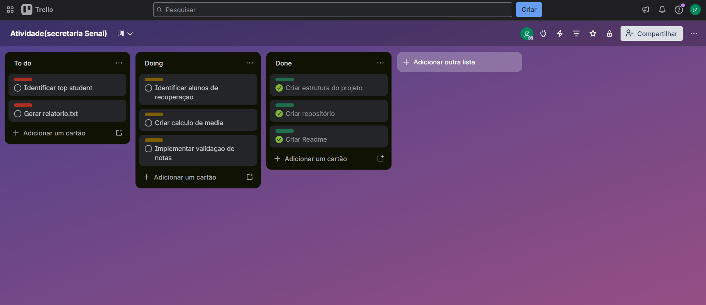

*LEVANTAMENTO DE REQUISITOS*

RF01:RECEBER DADOS DE ALUNOS.
RF02:VALIDAR SE A LISTA DE NOTAS ESTA VAZIA OU CORROMPIDA.
RF03:DESTAQUE PARA ALUNOS COM NOTAS BAIXAS E ALTAS.
RF04:SISTEMA ORGANIZADO DE FORMA MODULAR.
RF05:GERAR RELATORIO.
RF06:CALCULAR MEDIA DAS NOTAS.

RNF01:CODIGO ORGANIZADO E LEGIVEL.
RNF02:RELATORIO FORMATADO EM .TXT
RNF03:TRATAMENTO DE ERROS NOS DADOS
RNF04:USO DE VERSIONAMENTO COM GIT E BRANCHS

REGRA DE NEGOCIO:
RN01:Média menor que 7 = recuperação
RN02:Top student = maior média
RN03:Divisao obrigatoria em main.py e processamento.py.

*MAPA DA EMPATIA*
OQUE PENSA E SENTE?
PREOCUPAÇOES EM DAR UMA NOTA ERRADA PARA UM ALUNO.
PROFESSORES COM GRANDES DEMANDAS PARA ENTREGAR PARA ESCOLA.

OQUE OUVE?
RECLAMAÇOES DA FORMA ATUAL DE DE GERAR AS NOTAS.

OQUE VÊ?
DADOS BAGUNÇADOS.
NOTAS INCOMPLETAS.

OQUE FALA E FAZ?
PRECISA TOMAR DECISOES PEDAGOGICAS.

DORES:
DEMORA PARA GERAR RELATORIO.
FALTA DE CONFIABILIDADE NOS DADOS RECEBIDOS.
DIFICULDADE DE RECONHECER ALUNOS EM RISCO E ALUNOS COM ALTO DESEMPENHO.

*METODO KANBAN*

